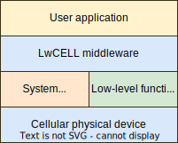

.. _um_arch:

Architecture
============

Architecture of the library consists of ``4`` layers.

	LwGSM layer architecture overview

Application layer
^^^^^^^^^^^^^^^^^

*User layer* is the highest layer of the final application.
This is the part where API functions are called to execute some command.

Middleware layer
^^^^^^^^^^^^^^^^

Middleware part is actively developed and shall not be modified by customer by any means.
If there is a necessity to do it, often it means that developer of the application uses it wrongly.
This part is platform independent and does not use any specific compiler features for proper operation.

.. note::
	There is no compiler specific features implemented in this layer.

System & low-level layer
^^^^^^^^^^^^^^^^^^^^^^^^

Application needs to fully implement this part and resolve it with care.
Functions are related to actual implementation with *GSM* device and are highly
architecture oriented. Some examples for `WIN32` and `ARM Cortex-M` are included with library.

.. tip::
	Check :ref:`um_porting_guide` for detailed instructions and examples.

System functions
****************

System functions are bridge between operating system running on embedded system and LwGSM middleware.
Functions need to provide:

* Thread management
* Binary semaphore management
* Recursive mutex management
* Message queue management
* Current time status information

.. tip::
	System function prototypes are available in :ref:`api_lwgsm_sys` section.

Low-level implementation
************************

Low-Level, or *LWGSM_LL*, is part, dedicated for communication between *LwGSM* middleware and *GSM* physical device.
Application needs to implement output function to send necessary *AT command* instruction aswell as implement
*input module* to send received data from *GSM* device to *LwGSM* middleware.

Application must also assure memory assignment for :ref:`api_lwgsm_mem` when default allocation is used.

.. tip::
	Low level, input module & memory function prototypes are available in 
	:ref:`api_lwgsm_ll`, :ref:`api_lwgsm_input` and :ref:`api_lwgsm_mem` respectfully.

GSM physical device
^^^^^^^^^^^^^^^^^^^

 .. toctree::
    :maxdepth: 2